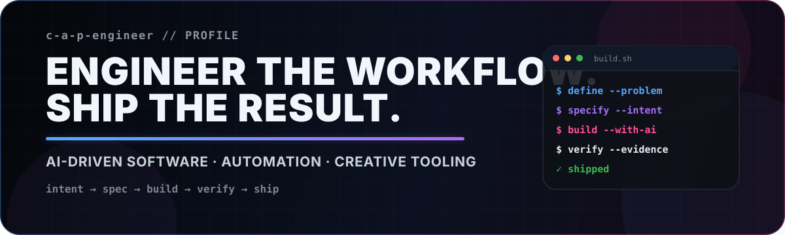
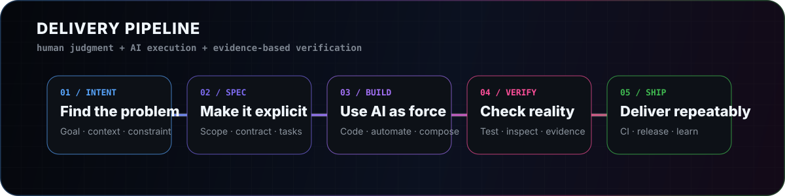

  

  
  
  
  

  <strong>SOFTWARE ENGINEER · AI-DRIVEN DEVELOPMENT · AUTOMATION · CREATIVE TOOLING</strong>

 

> ### 書くコードを減らし、仕組みを増やす。
>
> 問題を整理し、判断を仕様へ落とし込み、AIとCIを使って再現可能な成果物として出荷します。  
> 実装速度だけではなく、**設計・検証・運用まで含めた開発システム**を作ります。

 

## 01 — Engineering focus

<table>
  <tr>
    <td width="33%" valign="top">
      01 / DECIDE
      <h3>AI-driven development</h3>
      
AIへ実装を委譲しつつ、要件・設計・判断・レビューの責任は人間が持つ開発フローを設計します。

    </td>
    <td width="33%" valign="top">
      02 / AUTOMATE
      <h3>Reproducible systems</h3>
      
Docker、Dev Container、GitHub Actionsを軸に、環境差分と反復作業を減らします。

    </td>
    <td width="33%" valign="top">
      03 / CREATE
      <h3>Creative engineering</h3>
      
動画、スライド、技術書、ゲーム、教材を、コードと生成AIを組み合わせて制作します。

    </td>
  </tr>
</table>

 

## 02 — Selected builds

<table>
  <tr>
    <td width="50%" valign="top">
      VIDEO AUTOMATION
      <h3><a href="https://github.com/c-a-p-engineer/zundamotion">Zundamotion</a></h3>
      
YAML台本から、VOICEVOX音声・字幕・画像・BGM・効果音を合成してMP4を生成する動画制作パイプライン。

      
<code>Python</code> <code>FFmpeg</code> <code>VOICEVOX</code> <code>Docker</code>

      

        <a href="https://c-a-p-engineer.github.io/zundamotion/"><strong>View demo →</strong></a>
        &nbsp;·&nbsp;
        <a href="https://github.com/c-a-p-engineer/zundamotion"><strong>Repository →</strong></a>
      

    </td>
    <td width="50%" valign="top">
      DOCUMENT ENGINEERING
      <h3><a href="https://github.com/c-a-p-engineer/SlideForge">SlideForge</a></h3>
      
AIが編集しやすいHTMLスライドを、PNG・PDF・PPTXへ変換するテンプレート兼レンダリング基盤。

      
<code>Node.js</code> <code>Playwright</code> <code>HTML/CSS</code> <code>PPTX</code>

      
<a href="https://github.com/c-a-p-engineer/SlideForge"><strong>Repository →</strong></a>

    </td>
  </tr>
  <tr>
    <td width="50%" valign="top">
      LEARNING EXPERIENCE
      <h3><a href="https://github.com/c-a-p-engineer/kids-learning">kids-learning</a></h3>
      
スマートフォンやタブレットで、図形・記憶・数量・そろばん・時計・書字を段階的に学べるブラウザ教材。

      
<code>TypeScript</code> <code>Mobile First</code> <code>Accessibility</code> <code>GitHub Pages</code>

      

        <a href="https://c-a-p-engineer.github.io/kids-learning/"><strong>Play →</strong></a>
        &nbsp;·&nbsp;
        <a href="https://github.com/c-a-p-engineer/kids-learning"><strong>Repository →</strong></a>
      

    </td>
    <td width="50%" valign="top">
      BROWSER GAME
      <h3><a href="https://github.com/c-a-p-engineer/24365-it-warrior">24365 IT戦士 ― 目grep</a></h3>
      
流れ続けるログから検索条件に一致する行を見つける、スマートフォン向け高速探索ゲーム。

      
<code>JavaScript</code> <code>Game Design</code> <code>Mobile UI</code> <code>GitHub Pages</code>

      

        <a href="https://c-a-p-engineer.github.io/24365-it-warrior/"><strong>Play →</strong></a>
        &nbsp;·&nbsp;
        <a href="https://github.com/c-a-p-engineer/24365-it-warrior"><strong>Repository →</strong></a>
      

    </td>
  </tr>
</table>

### More tools & templates

[`ai-editor-playbook`](https://github.com/c-a-p-engineer/ai-editor-playbook)
· [`VivliostyleTemplate`](https://github.com/c-a-p-engineer/VivliostyleTemplate)
· [`codex-phaser-template`](https://github.com/c-a-p-engineer/codex-phaser-template)
· [`skill-sheet-maker`](https://github.com/c-a-p-engineer/skill-sheet-maker)
· [`ResponsiveCapture`](https://github.com/c-a-p-engineer/ResponsiveCapture)

 

## 03 — Build system

  

<table>
  <tr>
    <td width="50%" valign="top">
      <strong>Problem first</strong> 
      ツールや流行から始めず、解くべき問題と制約を先に特定する。
    </td>
    <td width="50%" valign="top">
      <strong>Specs are artifacts</strong> 
      README・仕様・タスクを、実装前から成果物として扱う。
    </td>
  </tr>
  <tr>
    <td width="50%" valign="top">
      <strong>AI accelerates, humans decide</strong> 
      AIは実装速度を上げ、人間は判断・検証・説明責任を担う。
    </td>
    <td width="50%" valign="top">
      <strong>Repeatability over heroics</strong> 
      個人技より、再現性・自動化・運用性・費用対効果を優先する。
    </td>
  </tr>
</table>

 

## 04 — Toolchain

**LANGUAGES**

  
  
  
  

**PLATFORM & AUTOMATION**

  
  
  
  

**MEDIA & CREATIVE TOOLING**

  
  
  
  

 

## 05 — Writing & knowledge sharing

<table>
  <tr>
    <td width="50%" valign="top">
      DEVELOPMENT LOG
      <h3><a href="https://c-a-p-engineer.github.io/">こぴぺたんログ</a></h3>
      
開発、生成AI、自動化、試行錯誤を、再利用可能な知識として記録しています。

    </td>
    <td width="50%" valign="top">
      TECHNICAL BOOKS
      <h3><a href="https://techbookfest.org/organization/5zdy9h5eA5kDzByP9rserV">技術書典</a></h3>
      
AI協働開発と実務で得たノウハウを、技術書として構成・出版しています。

    </td>
  </tr>
</table>

---

  <strong>DESIGN → SPECIFY → AUTOMATE → SHIP</strong> 
  
    Direction and judgment by the engineer. 
    Composition and implementation with AI.
  

