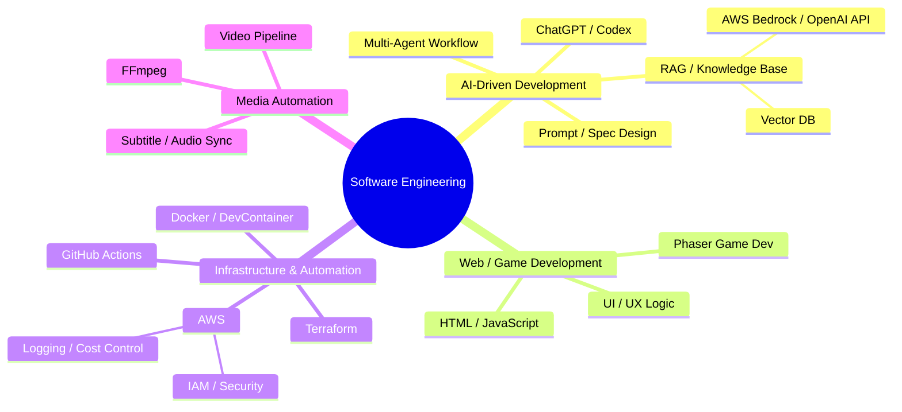

<!-- ===================== -->
<!--        AVATAR         -->
<!-- ===================== -->

  

  
    Avatar & Profile README generated with ChatGPT · Human-in-the-loop
  

<!-- ===================== -->
<!--         HERO          -->
<!-- ===================== -->

  
  
  
  

---

## 🧠 About Me

- ソフトウェアエンジニア
- AI駆動開発 / 自動化 / 開発フロー設計
- 「**書くコードを減らし、仕組みを増やす**」が信条
- 実装はAI、判断と設計は人間がやる

---

## 🎯 Philosophy

- 設計できないものは自動化できない
- AIは魔法ではなく**労働力**
- README・Spec・Task が成果物
- コードは消える、**仕組みは残る**

---

## 🧩 What I’m Working On

- 🎥 **AI動画生成パイプライン**（音声 / 字幕 / 画像 / FFmpeg）
- 🧠 **RAG / Knowledge Base**（AWS × Vector DB × Terraform）
- 🎮 **HTML / Phaser ゲーム開発**（AI実装 + CI即公開）
- 📘 **技術書執筆**（AI協働開発・マルチエージェント設計）

---

## 🌳 Skill Tree（Readable & Compact）

---

## 🎯 Philosophy

- 設計できないものは自動化できない
- AIは魔法ではなく**労働力**
- README・Spec・Task が成果物
- コードは消える、**仕組みは残る**

---

📊 GitHub Analytics

  

  

---

🧪 Development Style

DevContainer 前提（環境差分ゼロ）

PR駆動 + CI即実行

AIに実装させ、人間はレビュー

README / Spec / Task を最初に書く

---

📝 Blog & Writing

📓 Blog: https://c-a-p-engineer.github.io/

📕 技術書典: https://techbookfest.org/organization/5zdy9h5eA5kDzByP9rserV
AI駆動開発 / 自動化 / 実践知を中心に執筆

---

🤝 Contact

X: https://x.com/i/c_a_p_engineer

GitHub Issues / Discussions 歓迎

---

📝 このGitHubプロフィールREADMEは ChatGPT に生成させています。  
人間は設計と判断を担当し、表現と実装はAIに任せる──それ自体が、このアカウントの実践例です。

